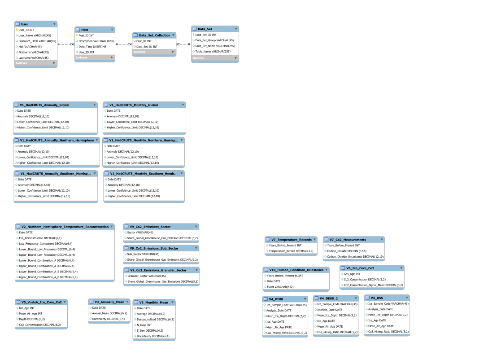
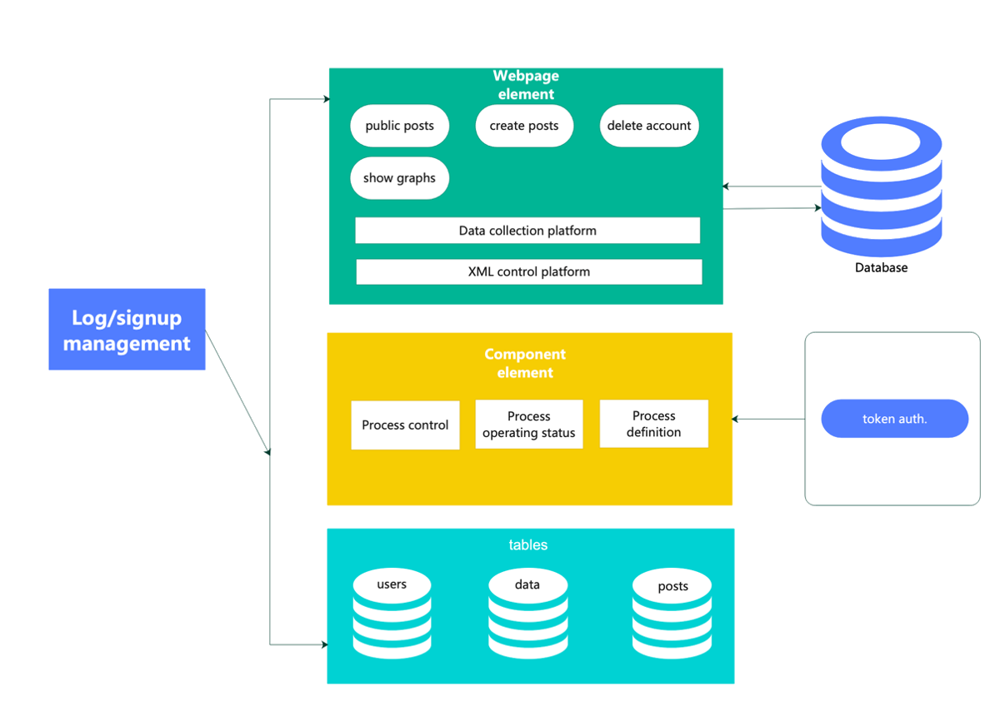

# About the Project

Everybody knows that climate change is one of the biggest problems that the world is currently facing. With that in our minds we wanted to build a website that could help people visualize the changes that took place over the years regarding the environment. Our project is meant to be used by both scientists and people without extensive knowledge regarding this subject because every visualization contains a short description of the graphic that is generated based on the data that the user chooses. The main purpose of our project is to help the user create graphics representing the evolution of a few key factors regarding the climate changes that occurred over the years. The user can choose what values to be represented in the custom visualization and see what other visualizations were built by the other members of the community.
You can choose whether you want to log in or use our website as a guest. The guest user can only see what visualizations were posted by the other users and the logged in ones can create their own visualizations as well as seeing what the others have posted.

# How was the Project

We started the Project with planning the database structure and analyzing the datasets. After successfully setting up the Google GCP account we started by creating the React.js App and setting up Node.js. We divided the work in two teams, Backend and Frontend. In the beginning we met 3 to 4 times a week and after that it decreased to 1 to 2 times a week.

# Description of the Technologies used

We used Node.js and React.js for the Frontend and Backend. To manage our Database, we used Google GCP. Visual Studio Code was used as well and XAMPP for the Server testing.

# Frontend Team

Our Members of the Frontend Team, Arnaud and Diana, did the Sign Up / Login and the design of the Website. They were also responsible for the responsiveness of the Website.

# Backend Team

The Backend Team, Nick and Tatiana, were responsible for the Backend and the Data. Nick did the Visualizations of the Website.

Diana and Tatiana did the Testing of the Website and the README.

# Schema of our Database Structure

Our Database has different types of tables and some of them are connected to each other. Roles, user_roles, users, post, data_set_collection and data_set are connected to each other. In Users we save our data from the registration form and in roles we can give each account a role like admin, user and moderator. After a user creates their own visualization, the information will be saved in the post table and then is shown on the public site. The post table retrieves the information from the data tables. Visualizations V1 to V10 are all separately saved in different tables but not connected to one.

# Architecture of the Application

Our website starts with the homepage (public view) where all the posts from different users are displayed. The Navigation Bar shows in the middle the visualizations N1, N2 and N3 buttons where graphs can be shown and the + button to create an own post. There is also the Logout Button and the Account Button on the right side next to the add button.

When a user is new and needs to sign up, then the button will show up on the right side. After successfully sign in the user can view their own account while clicking on the username.

# How to install and use the application

For using our Project, the main components of working with are Node.js and Visual Studio Code. After successfully installing Node.js (LTS Version is enough), open the Project in VSC and open the Terminal as well. Start by writing npm i for installing all the npm features and then the project will start with the command: npm start. Attention: we are working with Google GCP as our Database. For a functional Database you need to install XAMPP to have a local database and to create the Tables which are necessary for the Charts.

### Links
- [Backend](https://server-dot-positive-notch-368008.ew.r.appspot.com/)
- [Frontend](https://positive-notch-368008.ew.r.appspot.com)
- [GitHub Project](https://github.com/DIN28AWAP-Team8/swamp)
